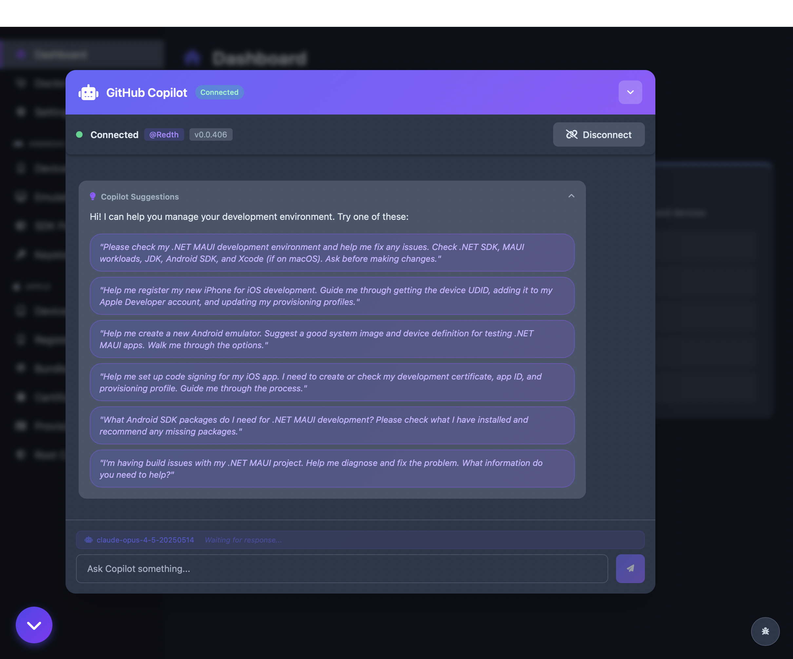

<p align="center">
  
</p>

<h1 align="center">MAUI Sherpa</h1>

<p align="center">
  <em>Let MAUI Sherpa guide you through all your .NET MAUI dev environment needs!</em>
</p>

<p align="center">
  <a href="https://github.com/Redth/MAUI.Sherpa/actions/workflows/build.yml"></a>
  <a href="https://opensource.org/licenses/MIT"></a>
</p>

MAUI Sherpa is a desktop application for **macOS** and **Windows** that helps manage your .NET MAUI development environment. It provides a unified interface for Android SDK management, Apple Developer tools, environment diagnostics, and GitHub Copilot integration.


## ✨ Features

### 🤖 GitHub Copilot Integration
- Chat with Copilot directly in the app
- Get AI-assisted help with your development environment
- Suggested prompts for common tasks

### 🩺 MAUI Doctor
- Check your development environment health
- Diagnose .NET SDK, workloads, and dependencies
- AI-powered fix suggestions via Copilot
- One-click environment repairs

### 📦 Android SDK Management
- Browse and install SDK packages
- Manage platform tools, build tools, and system images
- Search and filter packages
- Track installed vs available packages

### 📱 Android Emulators
- Create, edit, and delete emulators
- Start and stop emulators
- Create snapshots for quick boot
- View emulator details and configuration

### 🔑 Android Keystores
- Create and manage Android signing keystores
- View certificate signatures and details
- Export PEPK keys for Google Play
- Cloud sync keystores across machines

### 🍎 Apple Developer Tools (macOS only)
- **Simulators**: Manage iOS/iPadOS/tvOS/watchOS simulators with built-in inspector
- **Bundle IDs**: Create and manage App IDs with capabilities editor
- **Devices**: Register devices for development and ad-hoc distribution
- **Certificates**: Create, download, export, and revoke signing certificates
- **Provisioning Profiles**: Create, edit, and manage profiles with CI secrets export
- **Root Certificates**: Install Apple root certificates for development

### 🔍 Device Inspectors
- **Android**: Logcat viewer, file browser, shell, screen capture, and device tools
- **iOS Simulator**: Log viewer, app manager, screen capture, and simulator tools

## 📸 Screenshots

<details>
<summary><strong>🩺 Doctor</strong></summary>


</details>

<details>
<summary><strong>📦 Android SDK Packages</strong></summary>


</details>

<details>
<summary><strong>📱 Android Emulators</strong></summary>


</details>

<details>
<summary><strong>📲 Android Devices</strong></summary>


</details>

<details>
<summary><strong>🔑 Android Keystores</strong></summary>


</details>

<details>
<summary><strong>🍎 Apple Simulators</strong></summary>


</details>

<details>
<summary><strong>🍎 Apple Registered Devices</strong></summary>


</details>

<details>
<summary><strong>🍎 Apple Bundle IDs</strong></summary>


</details>

<details>
<summary><strong>🍎 Apple Certificates</strong></summary>


</details>

<details>
<summary><strong>🍎 Apple Provisioning Profiles</strong></summary>


</details>

<details>
<summary><strong>🍎 Create Provisioning Profile Wizard</strong></summary>


</details>

<details>
<summary><strong>🔐 CI Secrets Wizard</strong></summary>


</details>

<details>
<summary><strong>🍎 Root Certificates</strong></summary>


</details>

<details>
<summary><strong>🔍 Android Device Inspector</strong></summary>


</details>

<details>
<summary><strong>🔍 iOS Simulator Inspector</strong></summary>


</details>

<details>
<summary><strong>⚙️ Settings</strong></summary>


</details>

<details>
<summary><strong>🤖 GitHub Copilot</strong></summary>



</details>

## 🚀 Getting Started

### Prerequisites

- [.NET 10 SDK](https://dotnet.microsoft.com/download/dotnet/10.0)
- .NET MAUI workload (`dotnet workload install maui`)
- **macOS**: Xcode (for Apple tools and Mac Catalyst)
- **Windows**: Visual Studio 2022 or Windows App SDK

### Installation

Download the latest release from the [Releases](https://github.com/Redth/MAUI.Sherpa/releases) page.

#### macOS
1. Download `MAUI.Sherpa-macOS.zip`
2. Extract and move `MAUI Sherpa.app` to Applications
3. Right-click and select "Open" on first launch (to bypass Gatekeeper)

#### Windows
1. Download `MAUI.Sherpa-Windows.zip`
2. Extract to your preferred location
3. Run `MauiSherpa.exe`

### Apple Developer Tools Setup

To use the Apple Developer tools, you'll need to configure your App Store Connect credentials:

1. Go to [App Store Connect](https://appstoreconnect.apple.com/) → Users and Access → Keys
2. Create a new API key with "Developer" access
3. Download the `.p8` key file
4. In MAUI Sherpa, click the identity picker and add your credentials:
   - **Issuer ID**: Found on the Keys page
   - **Key ID**: The ID of your API key
   - **Private Key**: Contents of the `.p8` file

Your credentials are stored securely in the system keychain.

### GitHub Copilot Setup

To use the Copilot integration:

1. Install [GitHub Copilot CLI](https://docs.github.com/en/copilot/github-copilot-in-the-cli)
2. Authenticate with `gh auth login`
3. MAUI Sherpa will automatically detect and connect to Copilot

## 🛠️ Building from Source

```bash
# Clone the repository
git clone https://github.com/Redth/MAUI.Sherpa.git
cd MAUI.Sherpa

# Restore dependencies
dotnet restore

# Build for Mac Catalyst
dotnet build src/MauiSherpa -f net10.0-maccatalyst

# Build for Windows
dotnet build src/MauiSherpa -f net10.0-windows10.0.19041.0

# Run on Mac Catalyst
dotnet run --project src/MauiSherpa -f net10.0-maccatalyst

# Run tests
dotnet test
```

### Publishing

```bash
# Publish Mac Catalyst (Release)
dotnet publish src/MauiSherpa -f net10.0-maccatalyst -c Release

# Publish Windows (Release)
dotnet publish src/MauiSherpa -f net10.0-windows10.0.19041.0 -c Release
```

## 🏗️ Project Structure

```
MAUI.Sherpa/
├── src/
│   ├── MauiSherpa/               # Main MAUI Blazor Hybrid app
│   │   ├── Components/           # Reusable Blazor components
│   │   ├── Pages/                # Blazor page components
│   │   ├── Services/             # Platform-specific services
│   │   └── Platforms/            # Platform code (MacCatalyst, Windows)
│   ├── MauiSherpa.Core/          # Business logic library
│   │   ├── Handlers/             # Mediator request handlers
│   │   ├── Requests/             # Request records
│   │   ├── Services/             # Service implementations
│   │   └── ViewModels/           # MVVM ViewModels
│   └── MauiSherpa.Workloads/     # .NET workload querying library
├── tests/
│   ├── MauiSherpa.Core.Tests/    # Core library tests
│   └── MauiSherpa.Workloads.Tests/ # Workloads library tests
└── docs/                         # Documentation and screenshots
```

## 🧪 Running Tests

```bash
# Run all tests
dotnet test

# Run with coverage
dotnet test --collect:"XPlat Code Coverage"

# Run specific test project
dotnet test tests/MauiSherpa.Core.Tests
```

## 🤝 Contributing

Contributions are welcome! Please feel free to submit a Pull Request.

1. Fork the repository
2. Create your feature branch (`git checkout -b feature/amazing-feature`)
3. Commit your changes (`git commit -m 'Add some amazing feature'`)
4. Push to the branch (`git push origin feature/amazing-feature`)
5. Open a Pull Request

## 📄 License

This project is licensed under the MIT License - see the [LICENSE](LICENSE) file for details.

## 🙏 Acknowledgments

- [.NET MAUI](https://github.com/dotnet/maui) - Cross-platform UI framework
- [Shiny.Mediator](https://github.com/shinyorg/mediator) - Mediator pattern with caching
- [AndroidSdk](https://github.com/redth/androidsdk.tool) - Android SDK management APIs
- [AppleDev.Tools](https://github.com/redth/appledev.tools) - Apple Developer Tools APIs and AppStoreConnect API client
- [GitHub Copilot](https://github.com/github/copilot-sdk) - AI-powered assistance via Copilot SDK
